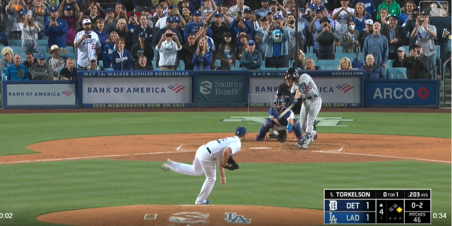
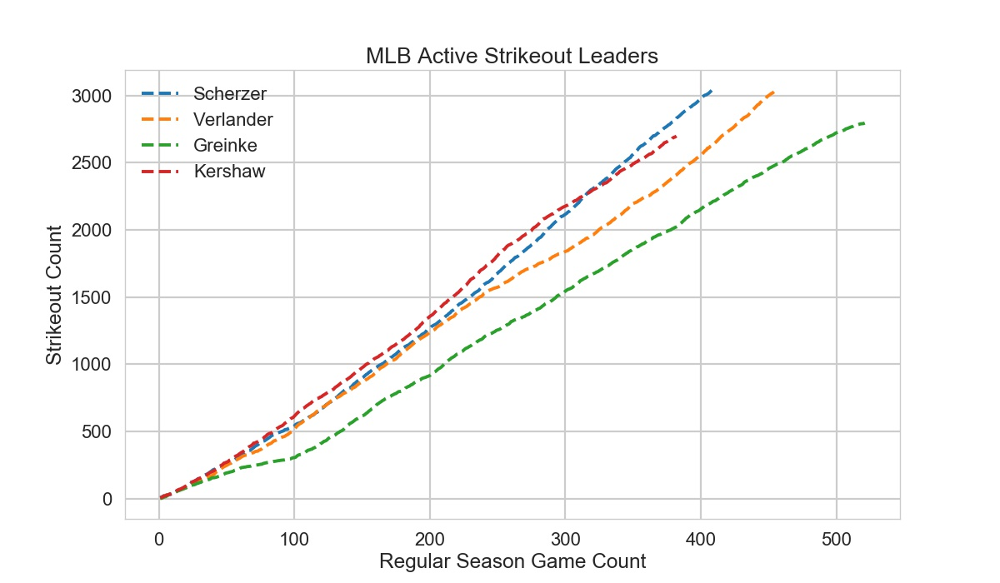

# Trajectories-of-Active-Strikeout-Leaders
Visualizing the path of active MLB strikeout leaders to their dominance

 

 

 

 

Conclusions include the observation that Kershaw's strikeout rate per game was best until after his 300th game where Kershaw crosses under Scherzer. Greinke and Verlander are on slower trajectories per game but have pitched a greater number of games than Kershaw. Scherzer is the current active strikeout king.