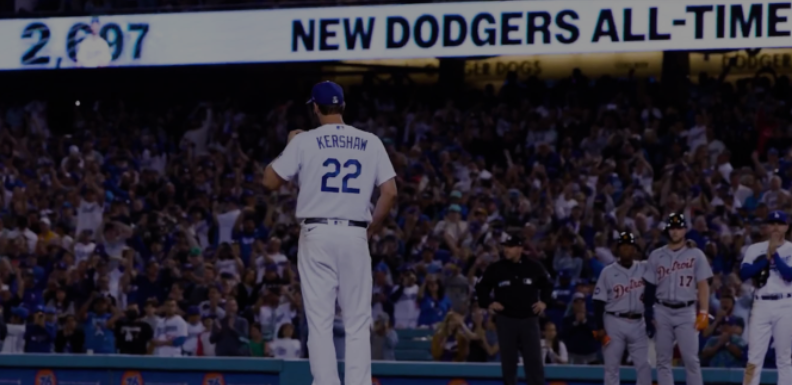

# Trajectories-of-Active-Strikeout-Leaders
Visualizing the path of active MLB strikeout leaders to their dominance

 

 

 

 

Conclusions include the observation that Kershaw's strike rate per game was best until late in his career where Kershaw crossed under Scherzer. Greinke and Verlander are on slower trajectories per game but have pitched a greater number of games than Kershaw.